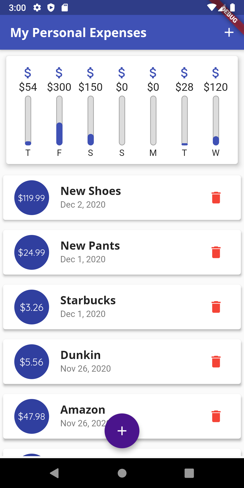

# Personal Expenses App

An app used to track personal expenses. It adds the expenses into a graph containing all the expenses for each day of the week for the past week.

## What I Learned:
	- Learn More About Widgets and Other Different Widgets
	- Theming the App and Material Design
	- Working with Images and Custom Fonts
	- Working with pubspec.yaml for dependencies
	- Adding Business Logic to the App
	- Making the app responsive
	- Making the app adoptive based on the device type

## How The App Looks

  

